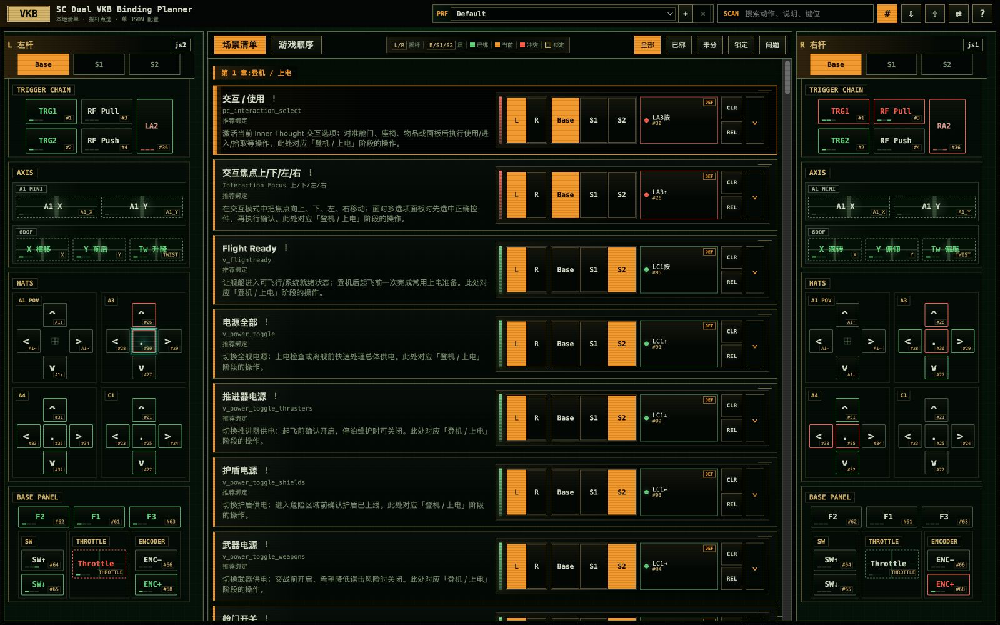

# SC Dual VKB Binding Planner

**Discover, create, and refine a Star Citizen HOSAS setup that fits the way you fly.**

从操作场景出发，找到并创造适合自己设备与玩法的操控配置——少一点对键位的迟疑，多一点飞行、战斗与探索的沉浸乐趣。

[**Launch Planner →**](https://airsun.github.io/sc-keybinding-planner/) · [Share feedback](https://github.com/airsun/sc-keybinding-planner/issues)

No install · Local-first · One shareable Workspace JSON

## Build a layout that becomes yours

A good HOSAS layout is more than a list of buttons. It is a control language shaped by your hardware, your ships, and the way you play. This planner turns that language into a visual workspace: explore operations by scenario, assign them directly on the sticks, and make shared actions, contextual reuse, and real conflicts understandable.

This release models one specific dual-stick VKB setup: a [Gladiator NXT EVO ‘Space Combat Edition’ - Right Hand](https://vkbsimcontrollers.com/products/gladiator-nxt-evo-space-combat-edition-right-hand-us) paired with a [Gladiator NXT EVO Omni Throttle - Left Hand](https://vkbsimcontrollers.com/products/gladiator-nxt-evo-omni-throttle-left-hand-us). It helps you plan and preserve a layout before reproducing it in the game's keybinding menus.

## 当前适配的设备

当前界面的摇杆布局、物理槽位与按键模型，以这套双摇杆（HOSAS）组合为设计基准：

- 右手：[VKB Gladiator NXT EVO ‘Space Combat Edition’ - Right Hand](https://vkbsimcontrollers.com/products/gladiator-nxt-evo-space-combat-edition-right-hand-us)
- 左手：[VKB Gladiator NXT EVO Omni Throttle - Left Hand](https://vkbsimcontrollers.com/products/gladiator-nxt-evo-omni-throttle-left-hand-us)

因此，当前版本还不是能够在界面中一键切换任意硬件的通用摇杆配置器。其他品牌或型号可以通过二次开发适配，主要需要调整设备定义、槽位映射及相应的界面呈现。未来可能继续扩展设备预设与切换能力，但目前不作具体版本承诺。

## 为什么做这个工具

复杂的 Star Citizen 操控配置往往散落在表格、截图、便签与肌肉记忆里。随着 Flight、Combat、Scanning、Mining、Salvage 等场景叠加，同一个物理键为什么复用、什么时候冲突，也会越来越难解释。

这个 Planner 希望把整套配置变成一张可以理解、调整和持续演进的操控地图：

- 从场景清单中发现真正需要的操作，而不是机械地填满所有按钮。
- 直接在左右摇杆上点选绑定，建立适合自己的空间记忆。
- 用 Profile、MODE 与 CTX 表达不同设备、飞船和玩法策略。
- 区分同一动作共享、互斥情境复用与真实冲突，减少误判。
- 把注意力从“这个键在哪里”还给飞行、战斗、探索与舰船操作本身。

## 能做什么

| 能力 | 带给玩家的价值 |
|---|---|
| 左右摇杆可视化点选 | 直接建立物理位置与游戏动作之间的联系 |
| 场景清单 / 游戏顺序 | 在任务流程和原始 keybinding 列表之间切换视角 |
| 多 Profile | 为不同设备、飞船或打法维护完整方案 |
| MODE + CTX | 表达 Tap、Hold 等触发方式，以及 Pilot、Mining、MFD 等操作情境 |
| 共享 / CTX 复用 / 冲突 | 解释同一物理槽位上的关系，只把真正的问题标红 |
| 本地保存 + JSON | 浏览器内持续编辑，并用单一 Workspace JSON 备份或分享 |
| GitHub Workspace Sync | 可选地把 Workspace 文件同步到自己的 GitHub 仓库 |

## 快速开始

1. 打开 [SC Dual VKB Binding Planner](https://airsun.github.io/sc-keybinding-planner/)。
2. 从“场景清单”或“游戏顺序”中选择一个动作。
3. 点击左杆或右杆上的目标槽位完成绑定。
4. 展开动作卡，根据需要设置 MODE、CTX、锁定与备注。
5. 检查共享、CTX 复用或冲突关系，再导出 Workspace JSON 作为备份。

## 四个核心概念

| 概念 | 含义 |
|---|---|
| **Workspace** | 全局设备编号、全部 Profile 与当前 UI 状态组成的单一 JSON 工作区 |
| **Profile** | 一套完整配置，可代表不同设备、飞船或打法策略 |
| **MODE** | 同一物理键在游戏绑定层的触发方式，例如 Press、Tap、Hold |
| **CTX** | 绑定生效的操作情境；明确互斥的情境可以安全复用同一槽位 |

更完整的配置模型和默认场景说明见 [SC Dual VKB 场景化配置说明](docs/sc-dual-vkb-scenario-config.md)。

## 数据与边界

- Planner 是本地优先的静态 Web App；Workspace 默认保存在当前浏览器。
- JSON 导入会覆盖当前 Workspace，操作前请先导出备份。
- GitHub Sync 是可选能力，需要玩家自行提供 fine-grained token；token 不会写入长期 localStorage。
- Planner 不会直接修改 Star Citizen 配置文件，也不会自动把绑定安装进游戏。

## 一起把操控体验做得更好

适合自己的配置没有唯一答案。设备组合、手型、常用舰船和玩法重点都会改变选择。如果你有设备适配经验、场景编排建议、绑定策略、可用性问题或功能想法，欢迎通过 [GitHub Issues](https://github.com/airsun/sc-keybinding-planner/issues) 参与讨论。

如果这个工具帮助你找到更顺手的操控方式，也欢迎分享你的 Workspace 思路，让更多玩家少走一点弯路。

---

This is an unofficial community tool and is not affiliated with or endorsed by Cloud Imperium Games. Star Citizen and related marks belong to their respective owners.
